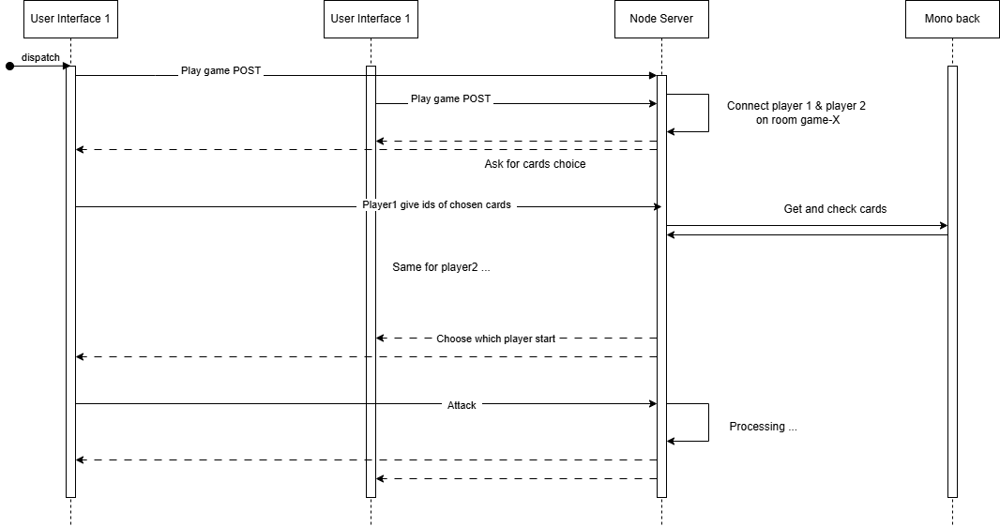

# asi-csbm-2

## Sommaire

1. [**Préambule**](#préambule)

   1.1. [Auteurs](#auteurs)  

   1.2. [Ressources](#ressources) 

   1.3. [Elements réalisés](#elements-réalisés) 

   1.4. [Elements non réalisés](#eléments-non-réalisés)

2. [**Atelier 2 : Node.js pour une interface de jeux et un chat**](#atelier-2)

   2.1. [Avantages de Node.js](#avantages-de-nodejs-pour-une-interface-de-jeux-et-un-chat-entre-utilisateurs)  

   2.2. [Inconvénients de Node.js](#inconvénients-de-nodejs-pour-une-interface-de-jeux-et-un-chat-entre-utilisateurs)

3. [**Atelier 3 : Docker vs Virtualisation classique**](#atelier-3)  

   3.1. [Différences entre Docker et la virtualisation classique](#avantages-et-différences-des-containers-docker-vis-à-vis-de-la-virtualisation-classique)  

   3.2. [Avantages des containers Docker](#avantages-des-containers-docker)  

   3.3. [Structure des dépôts](#structure-des-dépôts)  

   3.4. [Configuration Docker](#configuration-docker)  

   3.5. [CI/CD avec GitHub Actions](#cicd-avec-github-actions)

---

---

## Préambule

--- 

### Auteurs

- **Théo Clere**, **Sandro Spina**, **Maxime Brossard**, **Ceif Edine Marouani**  
  Étudiants en dernière année à CPE Lyon, filière 5IRC.

---

### Ressources

- **Dépôt principal :** [ASI-CSBM](https://github.com/SandroSpina698/ASI-CSBM) (branche atelier2)
- **Dépôt secondaire :** [ASI-CSBM-2](https://github.com/theoahga/asi-csbm-2) (branche main)
- **Docker Hub :** [theoahga](https://hub.docker.com/u/theoahga)

---

### Elements réalisés

- Avantages et inconvénients de Node.js (Maxime) 
- Prémière ébauche du serveur websocket/chat (Théo)
- Mise à jour de projet front pour accueillir le chat (Ceif & Sandro)
- Conception et réalisation du backend node.js du système de jeux (Théo & Maxime)
- Refactor du serveur node.js et subdivision en 3 micro-service: websocket, chat, game (Théo)
- Documentation des micro-services chat et websocket (Théo)
- Diagramme de séquences des interactions du système de jeux (Théo)
- Gestion de l'historisation de conversations du chat back (Sandro)
- Application spring permettant de logger les messages circulant sur l'ESB (Théo)
- Avantages et différences de docker vs Virtualisation classique (Théo)
- Création d'un dockerFile pour chacun des micro-service (Théo)
- Modification du docker-compose existant (atelier 1) + harmonisation du build (Théo)
- Github actions de build et push docker sur DockerHub (Théo)
- Documentation atelier 3 (Théo)

### Eléments non réalisés
- Mise en place d'un proxy global (Sandro a commencé) 
- Plateforme de jeux front ...
    - donc le back node.js micro-service game n'a pas été testé

---
## Atelier 2

### Avantages de Node.js pour une interface de jeux et un chat entre utilisateurs

- **Traitement en temps réel :** Node.js est idéal pour les applications en temps réel comme les jeux en ligne et le chat, grâce à son modèle d'événements et à son architecture non bloquante.
- **Écosystème riche et extensible :** Nombreuses bibliothèques, comme Socket.IO, pour des fonctionnalités interactives.
- **Facilité d'intégration des WebSockets :** Maintien des connexions bidirectionnelles ouvertes.
- **Facilité du langage :** JavaScript unifie le développement serveur et client.

### Inconvénients de Node.js pour une interface de jeux et un chat entre utilisateurs

- **Problèmes de traitement intensif :** Limité pour des calculs complexes.
- **Modèle monothreadé :** Peut créer des goulots d'étranglement.
- **Nécessité de gestion de la concurrence :** Conception soigneuse requise pour les connexions multiples.

---

### Architecture global

Le microservice WebSocket est essentiellement utilisé pour répondre au client. Ce dernier n'interagira avec le service WebSocket qu'au moment de sa connexion.

## Interactions game

---

---

## Atelier 3

---

### Avantages et différences des containers Docker vis-à-vis de la virtualisation classique

- **Architecture :**
  - Les VMs ont un OS dédié, tandis que Docker partage le noyau de l'hôte.
- **Performance :**
  - Docker est plus rapide et consomme moins de ressources que les VMs.
- **Isolation :**
  - VMs offrent une isolation complète ; Docker utilise des processus isolés.
- **Portabilité :**
  - Docker est plus portable, supporté sur divers environnements.

---

### Avantages des containers Docker

1. Légèreté et efficacité.
2. Portabilité accrue.
3. Gestion simplifiée avec Docker Compose.
4. Rapidité de déploiement.
5. Scalabilité idéale pour les microservices.

---

### Structure des dépôts

- **[ASI-CSBM (branche atelier2)](https://github.com/SandroSpina698/ASI-CSBM)** : Contient plusieurs microservices (discovery, gateway, etc.).
- **[ASI-CSBM-2 (branche main)](https://github.com/theoahga/asi-csbm-2)** : Microservices pour le chat, les jeux, les logs, et WebSocket.

#### Dépôt : ASI-CSBM (branche atelier2)

- **back/discovery** : Microservice de découverte.
- **back/gateway** : Passerelle API.
- **back/generate-picture-ms** : Microservice de génération d'images.
- **back/generate-properties** : Microservice de génération de propriétés.
- **back/generate-text-ms** : Microservice de génération de texte.
- **back/mono** : Application monolithique.
- **front** : Interface utilisateur.

#### Dépôt : ASI-CSBM-2 (branche main)

- **microservice-chat** : Microservice de gestion des chats.
- **microservice-game** : Microservice de gestion des jeux.
- **microservice-logging** : Microservice de gestion des logs.
- **microservice-websocket** : Microservice de communication WebSocket.

---

### Configuration Docker

- Chaque microservice possède son propre fichier `Dockerfile`.
- Le fichier `docker-compose.yml` permet de gérer les services collectivement.

---

### Architecture Docker

Nous avions opté pour une architecture simplifiée, en isolant chaque composant de notre système dans un conteneur distinct. 

---

### CI/CD avec GitHub Actions

- Les pipelines CI/CD construisent et publient les images Docker sur Docker Hub.
- [Exemple de workflow CI/CD](.github/workflows/docker-image.yml) pour `ASI-CSBM-2`.

